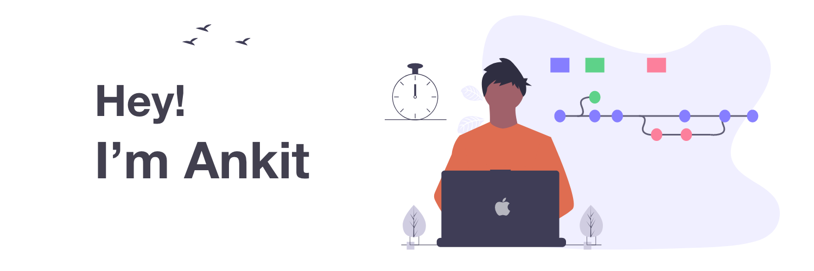

|  |
| ------ |

## Ankit Raj (he/him)

[![LinkedIn][linkedin-shield]][linkedin-url]
[![Twitter][twitter-shield]][twitter-url]

I lovee open-source! On my GitHub, You will find NPM libraries and other (mostly) JavaScript-based projects. I am currently working on creating a new static-site-generator [@abelljs](https://github.com/abelljs)

<h3 align="center">Languages, Frameworks and Tools:</h3>

     
     
     
     
     
     

[linkedin-shield]: https://img.shields.io/badge/-LinkedIn-black.svg?style=for-the-badge&logo=linkedin&colorB=555
[linkedin-url]: https://linkedin.com/in/github_username
[twitter-shield]: https://img.shields.io/twitter/follow/ankit_v2_1?style=for-the-badge&color=09f&labelColor=black.svg&logo=twitter&label=Twitter
[twitter-url]: https://twitter.com/ankit_v2_1
